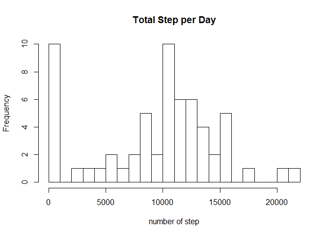
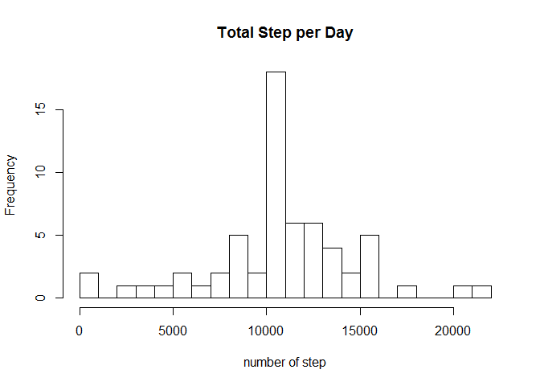
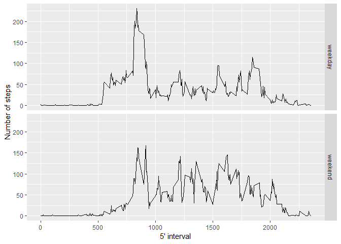

## Loading and preprocessing the data

```r
setwd("~/Progetti_R/RepData_Assign")
unzip(zipfile="activity.zip")
data <- read.csv("activity.csv")
```

## What is mean total number of steps taken per day?

```r
date<-as.factor(levels(data$date))
sum_step=NULL
for (i in 1:length(date)) {
  tmp<-sum(data$steps[data$date==date[i]],na.rm=TRUE)
  sum_step<-c(sum_step,tmp)}

hist(sum_step,breaks = 20,main="Total Step per Day",xlab="number of step")
```

<!-- -->

The meadian and mean number of step taken are shown:

```r
summary(sum_step)
```

```
##    Min. 1st Qu.  Median    Mean 3rd Qu.    Max. 
##       0    6778   10395    9354   12811   21194
```

## What is the average daily activity pattern?

```r
Interval<-levels(factor(data$interval))
Step_day<-matrix(ncol=2,nrow=length(Interval))
Step_day[,1]<-t(as.integer(Interval))

for (i in 1:length(Interval)) {
  Step_day[i,2]<-mean(data$steps[data$interval==Interval[i]],na.rm=TRUE)}

Step_day<-as.data.frame(Step_day)
names(Step_day)<-c("interval","step")

plot(Step_day[,1],Step_day[,2],type="l",
     xlab=" 5' Interval",ylab="Number of Steps",main="Average Step")
```

<!-- -->

On average across all the days in the dataset, the 5-minute interval that contains the maximum number of steps is:


```r
Step_day[which.max(Step_day$step),]
```

```
##     interval     step
## 104      835 206.1698
```

## Imputing missing values
The presence of missing values produce bias on summary of the data.
The tolal number of missing data is:

```r
sum(is.na(data$steps))
```

```
## [1] 2304
```

In order to remove this effect, the missing values are filled with mean value of the 5-minutes interval.

# Replace each missing value with the mean value of its 5-minute interval

```r
fill_value <- function(steps, interval) {
  filled <- NA
  if (!is.na(steps))
    filled <- c(steps)
  else
    filled <- (Step_day[Step_day$interval==interval,2])
  return(filled)
}

data_2<-data
for (i in 1:length(data_2$steps)) {
  data_2$steps[i]<-fill_value(data_2$steps[i],data_2$interval[i])
  }
```


```r
sum_step=NULL
for (i in 1:length(date)) {
  tmp<-sum(data_2$steps[data_2$date==date[i]],na.rm=TRUE)
  sum_step<-c(sum_step,tmp)
}

hist(sum_step,breaks = 20,main="Total Step per Day",xlab="number of step")
```

<!-- -->

```r
summary(sum_step)
```

```
##    Min. 1st Qu.  Median    Mean 3rd Qu.    Max. 
##      41    9819   10766   10766   12811   21194
```

Mean and median values are higher  and are the same after replacing missing data. Replacing missing values with the mean remove  0 values from the histogram of total number of steps taken each day.

## Are there differences in activity patterns between weekdays and weekends?

First, let's find the day of the week for each measurement in the dataset.


```r
week_day_end <- function(date) {
  day <- weekdays(date)
  if (day %in% c("lunedì", "martedì", "mercoledì", "giovedì", "venerdì"))
    return("weekday")
  else if (day %in% c("sabato", "domenica"))
    return("weekend")
  else
    stop("invalid date")
}
data_2$date <- as.Date(data_2$date)
for (i in 1:length(data_2$date)) {
  data_2$day[i]<-week_day_end(data_2$date[i])
}
```

## Now, let's make a panel plot containing average number of steps on weekdays and weekends.


```r
data_weekend<-subset(data_2,data_2$day=="weekend")
data_weekday<-subset(data_2,data_2$day=="weekday")

Step_weekend<-as.data.frame(matrix(ncol=3,nrow=length(Interval)))
names(Step_weekend)<-c("interval","day","step")
Step_weekend$interval<-as.integer(Interval)

for (i in 1:length(Interval)) {
  Step_weekend$step[i]<-mean(data_weekend$steps[data_weekend$interval==Interval[i]])
  Step_weekend$day[i]<-data_weekend$day[i]}

Step_weekday<-as.data.frame(matrix(ncol=3,nrow=length(Interval)))
names(Step_weekday)<-c("interval","day","step")
Step_weekday$interval<-as.integer(Interval)

for (i in 1:length(Interval)) {
  Step_weekday$step[i]<-mean(data_weekday$steps[data_weekday$interval==Interval[i]])
  Step_weekday$day[i]<-data_weekday$day[i]}

Step_week<-rbind(Step_weekday,Step_weekend)

library(ggplot2)
ggplot(Step_week, aes(interval, step)) + geom_line() + facet_grid(day ~ .) + xlab("5' interval") + ylab("Number of steps")
```

<!-- -->
